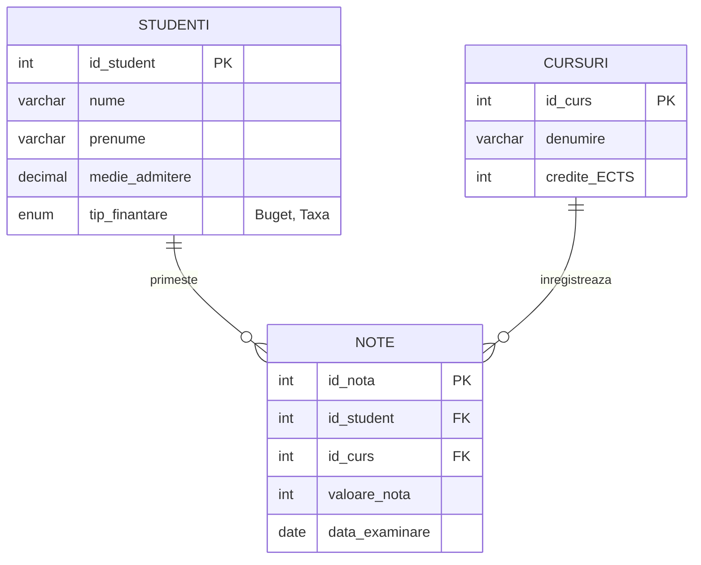

# Sistem de Gestiune al Activității Academice (Baze de Date Relaționale)

<div align="center">

[](Sistem%20de%20Gestiune%20al%20activitatii%20academice.sql)
[-orange?style=flat)](diagrama.mwb)
[](Sistem%20de%20Gestiune%20al%20activitatii%20academice.sql)
[-purple?style=flat)](../../PROJECTS.md)
[](../../PROJECTS.md)

</div>

---

## 1. Prezentare Generală

Acest proiect (`licenta/BD2-Proiect`) reprezintă proiectul de semestru dezvoltat în cadrul disciplinei **Baze de Date (BD)** la Facultatea de Economie și Administrarea Afacerilor (FEAA), Universitatea din Craiova.

Proiectul implementează modelul relațional și scriptul complet DDL/DML pentru administrarea activității studenților, cursurilor universitare, creditelor ECTS și catalogului de note pentru o facultate universitară.

---

## 2. Modelul Relațional de Date (ERD)



---

## 3. Structura Tabelelor și Relații de Integritate

1. **`studenti`:**
   * Înregistrează datele de identificare ale studenților, media de admitere și forma de finanțare a studiilor (`Buget` / `Taxă`).
2. **`cursuri`:**
   * Centralizează disciplinele academice din planul de învățământ și numărul de credite transferabile alocate conform sistemului european ECTS.
3. **`note`:**
   * Entitate asociativă ce materializează catalogul universitar. Realizează legătura tranzacțională între student și curs, stocând nota obținută (1–10) și data examinării.

---

## 4. Artefacte Incluse

* **`Sistem de Gestiune al activitatii academice.sql`:** Script SQL auto-conținut cuprinzând comenzile `CREATE DATABASE`, `CREATE TABLE` cu constrângeri de chei primare și străine, precum și inserții de date demo pentru testare.
* **`diagrama.mwb`:** Fișierul sursă de modelare vizuală compatibil **MySQL Workbench**, conținând diagrama conceptuală și fizică Entity-Relationship.

---

## 5. Instrucțiuni de Importare și Utilizare

Pentru a importa schema într-o instanță locală de MySQL:
```bash
mysql -u root -p < "licenta/BD2-Proiect/Sistem de Gestiune al activitatii academice.sql"
```

Sau deschideți fișierul `diagrama.mwb` în MySQL Workbench pentru a vizualiza sau extinde schema relațională.
