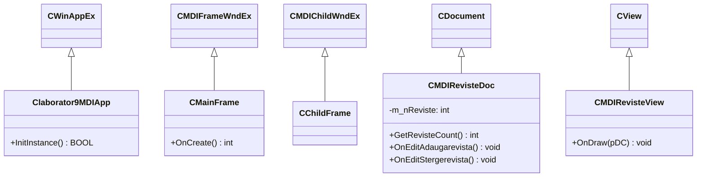

# Suită de Laboratoare Programare Orientată pe Obiecte (C++ / MFC)

[-purple?style=flat)](../../PROJECTS.md)

---

## 1. Prezentare Generală

Acest director (`licenta/POO2-Platforme`) conține platformele aplicative dezvoltate pe parcursul laboratoarelor de **Programare Orientată pe Obiecte (POO)** la Facultatea de Economie și Administrarea Afacerilor (FEAA), Universitatea din Craiova.

Fiecare platformă explorează concepte specifice de inginerie software în mediul Microsoft Windows:
* Moștenire și polimorfism în ierarhiile de clase MFC.
* Arhitectura bazată pe evenimente și hărți de mesaje (`MESSAGE_MAP`).
* Interfețe grafice de tip Dialog (`CDialogEx`) și controale standard Win32.
* Arhitectura avansată **Document/View** și aplicații cu ferestre multiple (**Multiple Document Interface — MDI**).

---

## 2. Catalogul Platformelor de Laborator

| Platformă | Proiect Solution | Tip Arhitectură | Concepte Cheie & Componente |
| :--- | :--- | :--- | :--- |
| **Platforma 2** | `MFCApplication3.slnx` | Dialog-Based | Mesaje de sistem, controale statice, butoane de comandă și validare date. |
| **Platforma 3** | `MFCApplication1.slnx` | Dialog-Based | Câmpuri de editare (`CEdit`), transfer de date dialog (`DoDataExchange`), legături variabile membru. |
| **Platforma 4** | `MFCApplication2.slnx` | Dialog-Based | Liste de selecție (`CListBox`), combo box-uri (`CComboBox`) și evenimente de selecție. |
| **Platforma 5** | `laborator5.slnx` | Dialog-Based | Meniuri contextualizate, acceleratori de tastatură și prelucrare de șiruri de caractere (`CString`). |
| **Platforma 6** | `MFCApplication1.slnx` | SDI / Explorer | Arhitectură Single Document Interface (SDI) cu panouri de navigare tip arbore (`ViewTree`, `PropertiesWnd`). |
| **Platforma 9 MDI** | `laborator9MDI.slnx` | MDI (Multiple Document) | Arhitectură Document/View completă pentru gestiunea publicațiilor și revistelor (`CMDIRevisteDoc`, `CMDIRevisteView`, `MainFrm`, `ChildFrm`). |

---

## 3. Arhitectura Document / View (MDI)

---

## 4. Instrucțiuni de Rulare

1. Deschideți soluția dorită (ex: `licenta/POO2-Platforme/Platforma9MDI/laborator9MDI.slnx`) în Microsoft Visual Studio 2022.
2. Selectați configurația de compilare `Release` sau `Debug` pe arhitectura `x64` sau `Win32`.
3. Compilați (`Build Solution` - `Ctrl+Shift+B`) și rulați executabilul (`F5`).
