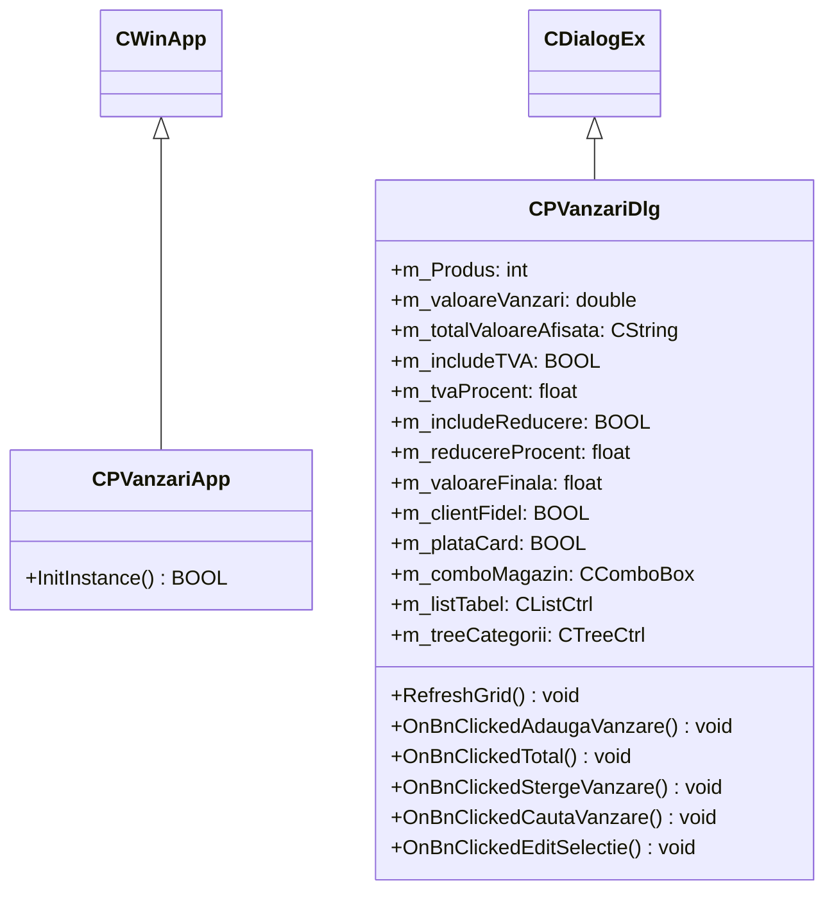

# Sistem de Gestiune a Vânzărilor Comerciale (C++ / MFC)

[-purple?style=flat)](../../PROJECTS.md)

---

## 1. Prezentare Generală

Acest proiect (`licenta/POO2-Proiect`) reprezintă aplicația practică de semestru dezvoltată în cadrul disciplinei **Programare Orientată pe Obiecte (POO)**, anul 2 de studii la Facultatea de Economie și Administrarea Afacerilor (FEAA), Universitatea din Craiova.

Aplicația oferă o interfață grafică completă (GUI) bazată pe arhitectura de dialoguri **Microsoft Foundation Classes (MFC)** pentru înregistrarea, căutarea, filtrarea și calculul contabil al vânzărilor comerciale pe magazine și categorii de produse, integrând suport pentru baza de date relațională MySQL via conectorul oficial **MySQL X DevAPI**.

---

## 2. Arhitectura Claselor și Componente GUI

---

## 3. Funcționalități Cheie

1. **Gestiune Tranzacțională:**
   * Înregistrarea vânzărilor cu specificarea produsului, magazinului de proveniență și valorii brute.
   * Suport pentru selecție ierarhică prin arbore de categorii (`CTreeCtrl`).
   * Vizualizare tabelară tabulară multi-coloană cu sortare (`CListCtrl`).
2. **Calcul Fiscal și Discounting:**
   * Aplicare dinamică TVA configurabil (`m_tvaProcent`).
   * Calcul automat reduceri promoționale și fidelizare clienți (`m_clientFidel`, `m_reducereProcent`).
   * Evidențiere mod de plată (Numerar vs. Card bancar).
3. **Persistență & Filtrare:**
   * Motor de căutare tranzacții după text sau magazin.
   * Integrare persistență MySQL pentru interogare și stocare permanentă a înregistrărilor de vânzare.

---

## 4. Cerințe de Sistem & Compilare

* **Sistem de Operare:** Microsoft Windows 10 / 11 (x86 sau x64)
* **IDE / Toolchain:** Microsoft Visual Studio 2022 cu pachetul *Desktop development with C++* și componenta *C++ MFC for latest v143 build tools*.
* **Biblioteci Externe:** MySQL Connector/C++ 8.x (pentru suport X DevAPI).
* **Soluție Visual Studio:** Deschideți fișierul `P_Vanzari.slnx` sau proiectul `P_Vanzari.vcxproj` și compilați în modul `Release | x64`.
