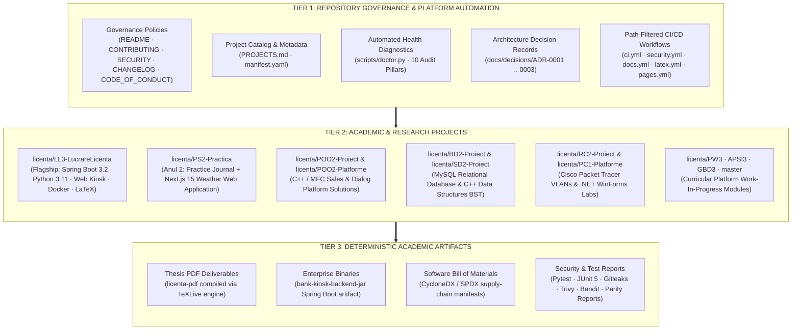
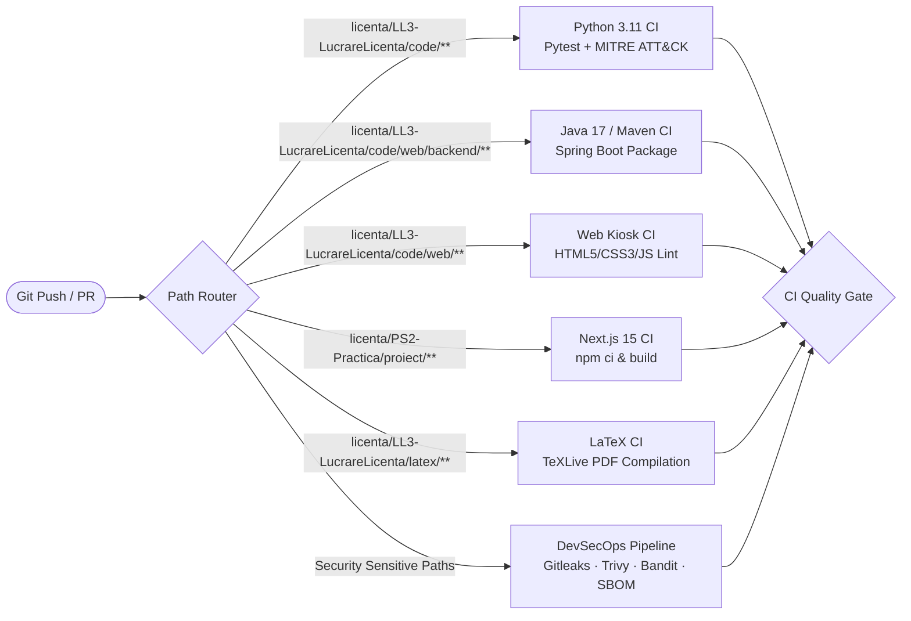

# Academic Software Monorepo & Cyber-Defense Engineering Platform

<div align="center">

[](https://github.com/Projects-FEAA-UCV/proiecte/actions/workflows/ci.yml)
[](https://github.com/Projects-FEAA-UCV/proiecte/actions/workflows/security.yml)
[](https://github.com/Projects-FEAA-UCV/proiecte/actions/workflows/docs.yml)
[](https://github.com/Projects-FEAA-UCV/proiecte/actions/workflows/latex.yml)
[](https://projects-feaa-ucv.github.io/proiecte/)
[](http://feaa.ucv.ro)
[](LICENSE)

</div>

---

## 1. Executive Overview

This repository serves as the official, centralized academic software monorepo for the **Faculty of Economics and Business Administration (FEAA)**, **University of Craiova**, documenting undergraduate coursework, applied laboratory platforms, internship engineering journals, and the flagship **Bachelor's Thesis in Economic Informatics (2026)**:

> **"Arhitectura și Securitatea Sistemelor Informatice Bancare: Proiectarea, Implementarea și Auditul Rezilienței Cibernetice într-un Mediu Virtualizat"**  
> **Author:** Moanță Ștefănuț-Cornel (@stefanutc1)  
> **Scientific Advisor:** Conf. univ. dr. [Nume Coordonator]  
> **Academic Program:** Informatică Economică, Promoția 2026  

The repository is organized under strict platform engineering and DevSecOps principles, operating as a deterministic **Source of Truth** for source code, virtualization configurations, automated test suites, and academic research artifacts.

---

## 2. Monorepo Three-Tier Architecture

The monorepo separates platform concerns into three decoupled operational tiers:



---

## 3. Master Academic Projects Directory

The monorepo consolidates curricular and extracurricular engineering projects across the 3-year Economic Informatics curriculum:

| Project Path | Academic Scope | Primary Stack | Build / Tooling | Automated Tests | CI/CD Gate |
| :--- | :--- | :--- | :--- | :--- | :---: |
| [`licenta/LL3-LucrareLicenta`](licenta/LL3-LucrareLicenta/) | **Bachelor's Thesis (Flagship)** | Java 17, Python 3.11, JS, Docker, LaTeX | Maven, pip, Docker, TeXLive | JUnit 5, Pytest, MITRE Sim | **PASS** |
| [`licenta/PS2-Practica`](licenta/PS2-Practica/) | Practical Training (Year 2) | Next.js 15, React 19, TypeScript, Tailwind | npm, Node.js 20 | Static Lint & Typecheck | **PASS** |
| [`licenta/PELL3-Practica`](licenta/PELL3-Practica/) | Practical Training (Year 3) | Markdown Practice Journal | Markdown Linter | Parity check | **PASS** |
| [`licenta/POO2-Proiect`](licenta/POO2-Proiect/) | Object-Oriented Programming | C++ / Microsoft Foundation Classes | Visual Studio MSBuild | None detected | **N/A** |
| [`licenta/POO2-Platforme`](licenta/POO2-Platforme/) | OOP Laboratory Platforms (2–9MDI) | C++ / MFC (Win32 API) | Visual Studio Solution | None detected | **N/A** |
| [`licenta/BD2-Proiect`](licenta/BD2-Proiect/) | Relational Database Systems | MySQL 8.0, SQL, MWB Data Model | MySQL Workbench | None detected | **N/A** |
| [`licenta/SD2-Proiect`](licenta/SD2-Proiect/) | Data Structures & Algorithms | C++ (Binary Search Trees, Linked Lists) | C++ Compiler / g++ | None detected | **N/A** |
| [`licenta/SD2-Teme`](licenta/SD2-Teme/) | Algorithmic Problem Solving | C++ Algorithmic Source Solutions | C++ Compiler | None detected | **N/A** |
| [`licenta/RC2-Proiect`](licenta/RC2-Proiect/) | Computer Networking Topologies | Cisco Packet Tracer (`.pkt`, `.pkz`) | Cisco Packet Tracer 8+ | Topology Validation | **PASS** |
| [`licenta/PC1-Platforme`](licenta/PC1-Platforme/) | Computer Programming Labs | C#, Visual Basic, .NET WinForms | MSBuild / Visual Studio | None detected | **N/A** |
| [`licenta/PW3-Platforma`](licenta/PW3-Platforma/) | Web Programming Platform (Year 3) | Web Technologies (HTML/CSS/JS) | Planned / In Progress | Planned | **WIP** |
| [`licenta/APSI3-Platforma`](licenta/APSI3-Platforma/) | Systems Analysis & Design | Enterprise Architecture Modeling | Planned / In Progress | Planned | **WIP** |
| [`licenta/GBD3-Platforma`](licenta/GBD3-Platforma/) | Database Management Platform | SQL / Advanced Database Administration | Planned / In Progress | Planned | **WIP** |
| [`master/`](master/) | Master's Degree Research | Advanced Information Systems | Planned (2026–2028) | Planned | **WIP** |

*For exhaustive technical descriptions, dependencies, and manifest schemas, see [PROJECTS.md](PROJECTS.md).*

---

## 4. Enterprise CI/CD & DevSecOps Architecture

All monorepo pipelines are path-aware, preventing redundant builds when unrelated files are modified:



### 4.1. Automated Quality Gates

| Workflow File | Focus Area | Quality Controls & Tools | Trigger / Frequency |
| :--- | :--- | :--- | :--- |
| [`.github/workflows/ci.yml`](.github/workflows/ci.yml) | Multi-Stack Continuous Integration | Python bytecode check, Pytest suite, 5 MITRE ATT&CK scenarios, Maven build & JUnit 5 tests, Spring Boot smoke test, Vanilla JS kiosk check, Next.js 15 build, Docker Buildx cache | Push / PR on code paths |
| [`.github/workflows/security.yml`](.github/workflows/security.yml) | DevSecOps & Supply Chain | Gitleaks v2 (secrets), TruffleHog, pip-audit (CVEs), npm audit, Bandit (SAST), Aqua Trivy (FS/Docker), CycloneDX SBOM generation | Push / PR on security paths |
| [`.github/workflows/docs.yml`](.github/workflows/docs.yml) | Academic Documentation Parity | Markdown syntax verification, relative link integrity, DOCX <-> LaTeX synchronization validation | Push / PR on docs / scripts |
| [`.github/workflows/latex.yml`](.github/workflows/latex.yml) | Academic Publishing Engine | Modular LaTeX compilation (`latexmk`), bibliography cross-referencing, PDF artifact bundling (`licenta-pdf`) | Push / PR on LaTeX paths |
| [`.github/workflows/deploy-gh-pages.yml`](.github/workflows/deploy-gh-pages.yml) | Continuous Delivery | Deploys static Web Banking Kiosk to GitHub Pages with dual-mode mock fallback | Workflow run completion / Dispatch |
| [`.github/dependabot.yml`](.github/dependabot.yml) | Dependency Governance | Weekly automated dependency version auditing across Actions, Maven, pip, and npm | Weekly Cron (Mondays) |

---

## 5. Security Policy & Vulnerability Management

The monorepo enforces a strict zero-tolerance policy against credential leaks and exploitable supply-chain vulnerabilities:

* **CRITICAL Severity:** Immediate build failure. Commit or PR cannot merge.
* **HIGH Severity:** Mandatory blocking failure when exploitable in application context. Documented mitigations required.
* **MEDIUM Severity:** Warning logged in step summary; requires review before release tags.
* **LOW / INFO:** Advisory notice tracked in automated security reports.

Academic mock credentials and non-production testing secrets used exclusively in isolated in-memory test suites are explicitly documented and governed via [`.gitleaks.toml`](.gitleaks.toml).

---

## 6. Academic Reproducibility & Research Integrity

In accordance with modern reproducible research standards, every claim and software artifact in the Bachelor's Thesis can be independently executed and verified:

1. **Environment Setup:** Standardized runtime specifications (Python 3.11, OpenJDK 17 LTS, Node.js 20 LTS, TeXLive).
2. **Automated Health Check:** Run the repository diagnostic engine:
   ```bash
   python3 scripts/doctor.py --verbose
   ```
3. **DOCX <-> LaTeX Parity Verification:**
   ```bash
   python3 scripts/sync_academic_docs.py --verify
   ```
4. **Live Banking Defense Simulation:**
   ```bash
   cd licenta/LL3-LucrareLicenta/code
   python3 banking_attack_simulator.py
   ```

*Complete instructions and step-by-step reproduction instructions are detailed in [`docs/reproducibility.md`](docs/reproducibility.md) and [`licenta/LL3-LucrareLicenta/reproducibility.md`](licenta/LL3-LucrareLicenta/reproducibility.md).*

---

## 7. Architecture Decision Records (ADRs)

Key architectural decisions are recorded and version-controlled under [`docs/decisions/`](docs/decisions/):

* [**ADR-0001:** Path-Aware Monorepo CI/CD Architecture](docs/decisions/ADR-0001-monorepo-path-aware-ci.md)
* [**ADR-0002:** Zero-Trust Banking Core & SIEM Audit Telemetry](docs/decisions/ADR-0002-banking-security-zero-trust-architecture.md)
* [**ADR-0003:** Academic Document Parity & Modular LaTeX Publishing Pipeline](docs/decisions/ADR-0003-academic-reproducibility-and-latex-parity.md)

---

## 8. Contributing & Code of Conduct

All student and collaborator contributions must adhere to:
* [CONTRIBUTING.md](CONTRIBUTING.md) — Git workflow, branch conventions, PR requirements.
* [CODE_OF_CONDUCT.md](CODE_OF_CONDUCT.md) — Academic honesty, research integrity, professional ethics.
* [SECURITY.md](SECURITY.md) — Responsible disclosure of vulnerabilities and security testing guidelines.
* [SUPPORT.md](SUPPORT.md) — Academic contact and issue submission procedures.

---

## 9. License & Academic Attribution

This software monorepo is published under the **MIT License**. See [LICENSE](licenta/LL3-LucrareLicenta/LICENSE) for legal terms.

Academic papers, theses, and derivative research utilizing this architecture or code should cite:
```bibtex
@mastersthesis{moanta2026licenta,
  author       = {Moanță, Ștefănuț-Cornel},
  title        = {Arhitectura și Securitatea Sistemelor Informatice Bancare: Proiectarea, Implementarea și Auditul Rezilienței Cibernetice într-un Mediu Virtualizat},
  school       = {Universitatea din Craiova, Facultatea de Economie și Administrarea Afacerilor},
  year         = {2026},
  type         = {Lucrare de Licență},
  address      = {Craiova, România}
}
```
