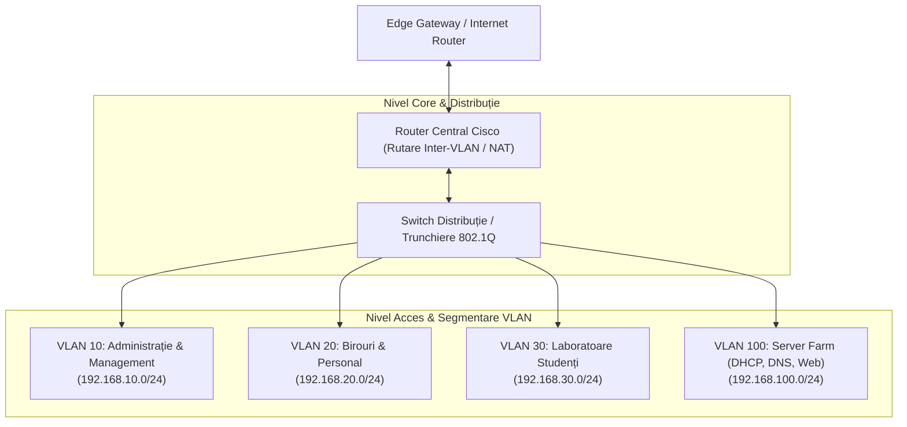

# Proiect Arhitectură și Segmentare Rețele de Calculatoare (Cisco Packet Tracer)

[-purple?style=flat)](../../PROJECTS.md)

---

## 1. Prezentare Generală

Acest proiect (`licenta/RC2-Proiect`) reprezintă proiectul practic elaborat în cadrul disciplinei **Rețele de Calculatoare (RC)** la Facultatea de Economie și Administrarea Afacerilor (FEAA), Universitatea din Craiova.

Proiectul implementează o topologie completă de rețea enterprise simulată în **Cisco Packet Tracer**, demonstrând principiile de proiectare, adresare IPv4, segmentare logică prin VLAN-uri și rutare inter-VLAN.

---

## 2. Arhitectura Topologiei de Rețea

---

## 3. Concepte și Servicii Configurate

1. **Segmentare Logică (VLAN-uri & IEEE 802.1Q):**
   * Separarea traficului între departamente pentru îmbunătățirea securității și reducerea domeniului de difuzare (broadcast domain).
   * Legături de tip Trunk între switch-uri și routere cu încapsulare 802.1Q.
2. **Rutare Inter-VLAN:**
   * Configurare Router-on-a-Stick cu sub-interfețe logice pentru rutarea controlată între subrețele.
3. **Servicii de Rețea:**
   * Alocare dinamică a adreselor IP prin pool-uri DHCP dedicate fiecărui VLAN.
   * Rezoluție de nume DNS internă și servicii web locale.
   * Liste de control al accesului (ACL) pentru filtrarea traficului nesigur.

---

## 4. Artefacte de Simulare

* **`proiect retele.pkt`:** Topologia principală de simulare Cisco Packet Tracer.
* **`proiect retele.pkz`:** Pachetul complet de activitate comprimat incluzând stările echipamentelor și verificările de conectivitate.

Pentru deschiderea și testarea rețelei, utilizați **Cisco Packet Tracer v8.0** sau o versiune ulterioară.
