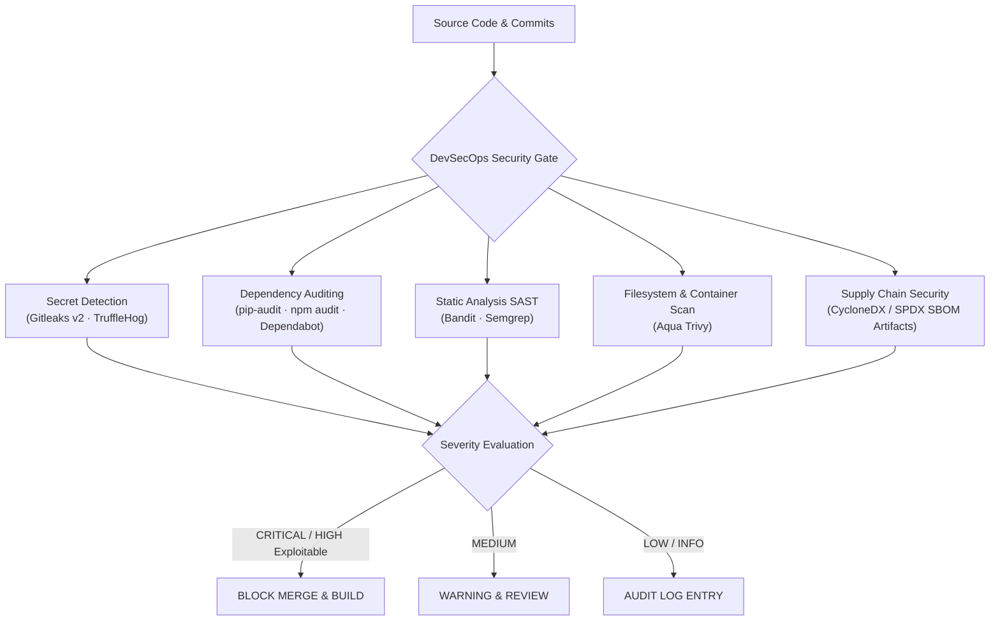

# Security Policy & Vulnerability Management

---

## 1. Security Philosophy & Scope

This repository houses academic software, cyber-defense simulation engines, and the flagship **Bachelor's Thesis in Economic Informatics** centered on banking security architecture.

We maintain a strict DevSecOps security model across all monorepo components:

---

## 2. Severity Classification & Enforcement

| Severity | Definition & Application Context | CI/CD Pipeline Behavior | Remediation SLA |
| :--- | :--- | :---: | :---: |
| **CRITICAL** | Cleartext private keys, unauthenticated RCE, hardcoded production secrets, SQL injection in authentication paths. | **BLOCKING (Job Exits 1)** | Immediate (< 24 hours) |
| **HIGH** | Known CVEs with public exploits in runtime dependencies, privilege escalation vulnerabilities, missing cryptographic verification. | **BLOCKING** when exploitable; documented mitigation required. | < 7 days |
| **MEDIUM** | Insecure default configurations, weak ciphers, lack of rate-limiting, non-exploitable transitive dependencies. | **WARNING** (Summary logged) | < 30 days |
| **LOW / INFO** | Code quality warnings, style discrepancies, informational CVE advisories without practical attack surface. | **INFORMATIONAL** | Best effort |

---

## 3. Allowed Academic Mock Credentials

In accordance with Section 16 of our architecture, the banking simulator and unit tests require realistic financial structures (e.g. sample PAN card numbers, HMAC signing keys, and JWT mock tokens) to simulate MITRE ATT&CK scenarios in memory.

All such testing fixtures are governed under [`.gitleaks.toml`](.gitleaks.toml):
* They must **never** correspond to real bank cards, live accounts, or production API keys.
* Paths containing mock fixtures are strictly bounded:
  - `licenta/LL3-LucrareLicenta/code/web/backend/src/main/resources/application.yml`
  - `licenta/LL3-LucrareLicenta/code/web/js/mock-engine.js`
  - `licenta/LL3-LucrareLicenta/code/payment_gateway_simulator.py`
  - `licenta/LL3-LucrareLicenta/code/banking_attack_simulator.py`

---

## 4. Software Bill of Materials (SBOM)

The monorepo automatically compiles machine-readable Software Bill of Materials (SBOM) in **CycloneDX** and **SPDX** standard formats for all production-grade applications:
* Java Spring Boot Backend (`target/bom.json`)
* Python Banking Engine (`dist/bom.json`)

SBOM artifacts are attached to every CI run and preserved in release tags.

---

## 5. Reporting a Security Vulnerability

If you discover a security flaw, vulnerability, or accidental secret exposure within this repository:

1. **Do NOT open a public GitHub issue.**
2. Send an advisory email to:
   * **Lead Maintainer:** `@stefanutc1` via GitHub Security Advisory or email.
   * **Faculty Coordinator:** Conf. univ. dr. [Nume Coordonator], Universitatea din Craiova.
3. Include a detailed description of the vulnerability, affected components, reproduction steps, and potential exploit impact.
4. The security team will acknowledge receipt within 48 hours and coordinate remediation.
