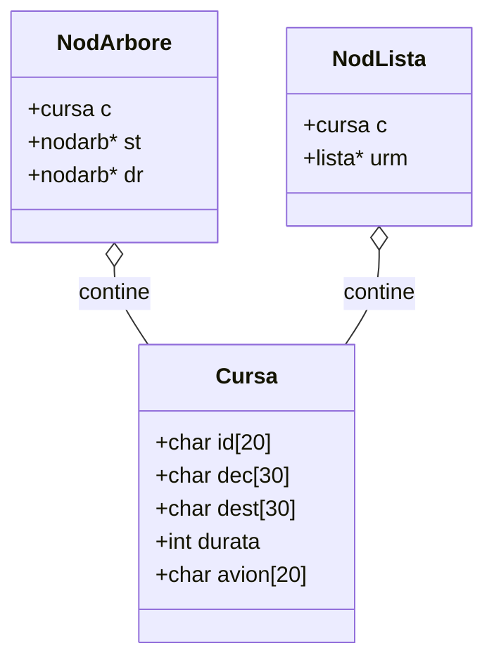

# Sistem de Gestiune Curse Aeriene (C++ / Structuri de Date)

<div align="center">

[](main.cpp)
[](arbore.h)
[](fisier.h)
[-purple?style=flat)](../../PROJECTS.md)
[](../../PROJECTS.md)

</div>

---

## 1. Prezentare Generală

Acest proiect (`licenta/SD2-Proiect`) reprezintă proiectul practic de semestru dezvoltat în cadrul disciplinei **Structuri de Date (SD)** la Facultatea de Economie și Administrarea Afacerilor (FEAA), Universitatea din Craiova.

Aplicația gestionează un catalog operațional de curse aeriene (zboruri comerciale), demonstrând implementarea, manipularea și persistența a două structuri fundamentale de date:
1. **Arbori Binari de Căutare (BST):** Pentru indexare și căutare eficientă a zborurilor.
2. **Liste Simplu / Dublu Înlanțuite Dinamice:** Pentru manipularea secvențială a curselor în memorie.
3. **Persistență în Fișiere:** Serializarea și deserializarea înregistrărilor pe disc.

---

## 2. Structura de Date Modelată (`cursa`)



---

## 3. Meniul Interactiv și Operații Disponibile

Aplicația rulează în consolă (CLI) și expune un meniu numeric:

| Opțiune | Funcție C++ | Descriere Operațională |
| :---: | :--- | :--- |
| `1` | `creare_fisier()` | Inițializează fișierul de date și stochează înregistrările de zbor. |
| `2` | `afis_fisier()` | Parcurge și afișează toate zborurile salvate pe disc. |
| `3` | `actualizare_fisier()` | Modifică atributele unei curse existente în fișier. |
| `4` | `creare_lista(l)` | Populează o listă dinamică înlănțuită din datele introduse de utilizator. |
| `5` | `afis_lista(l)` | Parcurge secvențial lista înlănțuită și listează zborurile. |
| `6` | `actualizare_lista(l)` | Actualizează un nod din lista înlănțuită. |
| `7` | `creare_arbore(a)` | Construiește un arbore binar de căutare (BST) inserând nodurile ordonat. |
| `8` | `afis_arbore(a)` | Parcurge arborele binar (inordine) afișând zborurile sortate. |
| `0` | `exit` | Încheie execuția programului. |

---

## 4. Instrucțiuni de Compilare și Rulare

Puteți compila proiectul cu orice compilator modern de C++ (`g++`, `clang++` sau `MSVC`):

```bash
cd licenta/SD2-Proiect
g++ -std=c++17 -Wall main.cpp fisier.cpp lista.cpp arbore.cpp -o gestiune_curse
./gestiune_curse
```
