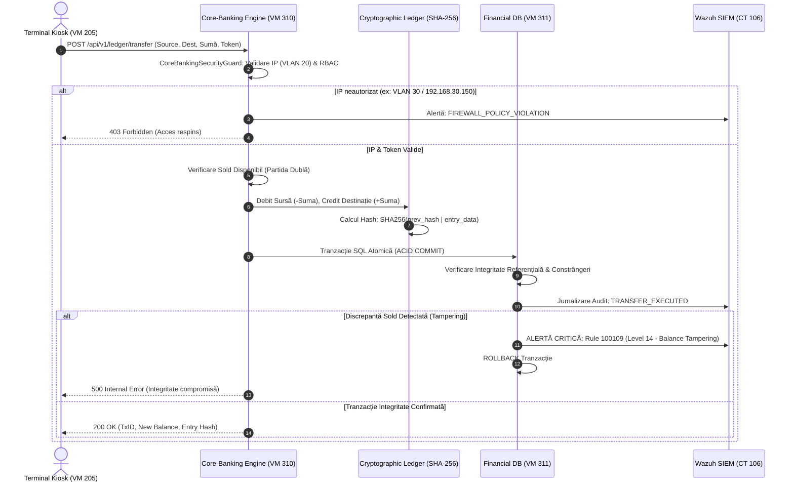
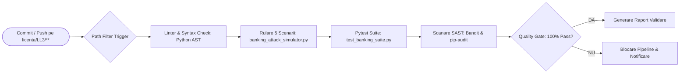

# Banking Core, Payment Gateway & Security Attack Simulation Suite

<div align="center">

[](https://github.com/Projects-FEAA-UCV/proiecte/actions/workflows/ll3-ci.yml)
[](requirements.txt)
[](payment_gateway_simulator.py)
[](database_audit_monitor.py)
[](../README.md)
[-success)](banking_attack_simulator.py)
[](../LICENSE)

</div>

---

## 1. Executive Overview

Acest director (`licenta/LL3-LucrareLicenta/code`) conține suita autonomă de simulare, procesare financiară și testare a rezilienței cibernetice dezvoltată în cadrul lucrării de licență:

> **„Arhitectura și Securitatea Sistemelor Informatice Bancare: Proiectarea, Implementarea și Auditul Rezilienței Cibernetice într-un Mediu Virtualizat”**  
> **Instituție:** Universitatea din Craiova — Facultatea de Economie și Administrarea Afacerilor (FEAA)  
> **Program de Studii:** Informatică Economică (Promoția 2026)  
> **Absolvent:** Moanță Ștefănuț-Cornel

Suita reproduce comportamentul operațional al unui sistem bancar integrat distribuit pe 4 active virtualizate pe platforma de virtualizare **Proxmox VE**, segmentate prin firewall perimetral de nivel L3 (**OPNsense**) și monitorizate continuu prin sisteme de detecție a intruziunilor (**Suricata NIDS/IPS**) și SIEM (**Wazuh HIDS**):

* **VM 310 (Core-Banking Engine):** Motor central inspirat din modelul de contabilitate bancară *Apache Fineract / Mifos X*, implementând principiul partidei duble (*Debite = Credite*), registrul contabil neschimbabil (General Ledger) protejat prin lanț de hash-uri criptografice SHA-256 și control strict al accesului (RBAC).
* **VM 311 (Financial Database & Wazuh Auditor):** Bază de date relațională financiară (model PostgreSQL) cu tranzacții atomice (ACID), constrângeri stricte de integritate referențială și un motor de inspecție SIEM capabil să detecteze tentative de SQL Injection și manipulare ilicită a soldurilor (*Balance Tampering* — Regula Nivel 14).
* **CT 312 (Payment Gateway & SWIFT Simulator):** Microserviciu FastAPI pentru autorizarea plăților electronice cu carduri (Visa, Mastercard, Amex), verificarea sumei de control Luhn (Mod 10), mascare PCI-DSS PAN, verificări de viteză anti-fraudă (*Card Stuffing*) și decontare interbancară de mare valoare (**SWIFT MT103 / ISO 20022 pacs.008** cu identificator unic UETR RFC 4122).
* **VM 313 (Hardened Bastion Jump-Box):** Punct unic de acces administrativ în rețeaua de management (VLAN 10) securizat prin chei criptografice Ed25519 și autentificare cu doi factori (MFA/TOTP), blocând tentativele de traversare laterală către serverele bancare din VLAN 20.

---

## 2. Arhitectură și Topologie de Securitate

### 2.1. Topologia Rețelei și Fluxul de Tranzacționare

```mermaid
flowchart TB
    subgraph WAN_EXT ["Rețea Externă / Perimetru"]
        INTERNET["Internet / Trafic Tranzacțional Client"]
        ATTACKER["Subnet Adversar / Lab Atac (192.168.30.0/24)"]
    end

    subgraph FIREWALL ["Perimetru Securizat (VM 200: OPNsense L3 Firewall)"]
        direction TB
        SURICATA["Suricata NIDS/IPS (Inspecție Pachete & Rate-Limiting)"]
        RULES["Reguli Firewall & Izolare VLAN (10 / 20 / 30)"]
        SURICATA --> RULES
    end

    INTERNET --> SURICATA
    ATTACKER --> SURICATA

    subgraph VLAN10 ["VLAN 10: Management Securizat (192.168.10.0/24)"]
        VM313["VM 313: Hardened Bastion Jump-Box<br/>IP: 192.168.10.50<br/>Ed25519 SSH + TOTP MFA"]
    end

    subgraph VLAN20 ["VLAN 20: Servicii de Producție Financiar-Bancară (192.168.20.0/24)"]
        direction TB
        CT312["CT 312: Payment Gateway & SWIFT API<br/>FastAPI (:8000)<br/>IP: 192.168.20.52<br/>Luhn Mod 10 | PCI-DSS | ISO 20022"]
        VM310["VM 310: Central Core-Banking Engine<br/>FastAPI (:8080)<br/>IP: 192.168.20.50<br/>Partidă Dublă | SHA-256 Ledger"]
        VM311["VM 311: Financial Database Server<br/>PostgreSQL Engine (ACID)<br/>IP: 192.168.20.51<br/>Integritate Referențială | Audit Log"]
        KIOSK["Terminal Kiosk / Casierie (VM 205)<br/>IP: 192.168.20.100<br/>Web Interface + Spring Boot (:8080)"]
    end

    subgraph SIEM_SOC ["Monitorizare SOC / SIEM (CT 106 / VM 106)"]
        WAZUH["Wazuh SIEM Manager & Dashboard<br/>IP: 192.168.1.240<br/>Reguli 100101, 100105, 100109"]
    end

    RULES -- "Port 22/SSH (Doar Admin)" --> VM313
    RULES -- "Port 8000/HTTP (Plăți)" --> CT312
    RULES -- "Port 8080/HTTP (Kiosk)" --> KIOSK
    RULES -- "Drop / Reject Politică L3" -.-> ATTACKER

    VM313 -. "Tunnel SSH Autorizat" .-> VM310
    KIOSK -->|Interogare Sold / Transfer| VM310
    CT312 -->|Decontare Încasări Card / SWIFT| VM310
    VM310 -->|Persistență Tranzacțională ACID| VM311

    VM311 -. "Wazuh Agent HIDS (JSON Audit)" .-> WAZUH
    VM310 -. "Wazuh Agent HIDS (Security Events)" .-> WAZUH
    KIOSK -. "Jurnal Structurat /var/log/bank-app" .-> WAZUH
```

### 2.2. Diagrama de Secvență: Execuție Tranzacțională și Audit SIEM



---

## 3. Specificații Tehnice ale Componentelor

### 3.1. Matricea Modulelor Software

| Fișier | Rol Arhitectural | Port / Protocol | Tehnologii Cheie | Standarde Relevante |
| :--- | :--- | :--- | :--- | :--- |
| [`payment_gateway_simulator.py`](file:///Users/s3nnnzzzatyeeee/stefannut_repos/proiecte/licenta/LL3-LucrareLicenta/code/payment_gateway_simulator.py) | Simulator Procesare Plăți & Decontare Interbancară | Port `8000` / HTTP REST | FastAPI, Uvicorn, Pydantic, UUID v4 | PCI-DSS v4.0, PSD2 EBA RTS, ISO 20022 (`pacs.008`), SWIFT MT103 |
| [`core_banking_service.py`](file:///Users/s3nnnzzzatyeeee/stefannut_repos/proiecte/licenta/LL3-LucrareLicenta/code/core_banking_service.py) | Motor Central Contabilitate & Gestiune Solduri | Port `8080` / HTTP REST | FastAPI, SHA-256 Hash Chain, RBAC Guards | Partidă Dublă (*Debite = Credite*), Apache Fineract Architecture |
| [`database_audit_monitor.py`](file:///Users/s3nnnzzzatyeeee/stefannut_repos/proiecte/licenta/LL3-LucrareLicenta/code/database_audit_monitor.py) | Bază de Date Relațională & Agent Audit Wazuh | In-Memory SQLite / PostgreSQL Engine | SQLite3 Engine, Wazuh Rule Engine, Regex | Proprietăți ACID, Constrângeri 3NF, Wazuh SIEM HIDS Rules |
| [`banking_attack_simulator.py`](file:///Users/s3nnnzzzatyeeee/stefannut_repos/proiecte/licenta/LL3-LucrareLicenta/code/banking_attack_simulator.py) | Orchestrator Red Team / Blue Team & Test Harness | CLI Standalone Runner | Python 3, Harness Orchestrator | Cadrul MITRE ATT&CK Enterprise (5 Scenarii de Securitate) |
| [`test_banking_suite.py`](file:///Users/s3nnnzzzatyeeee/stefannut_repos/proiecte/licenta/LL3-LucrareLicenta/code/test_banking_suite.py) | Suită Unit & Integration Testing pentru CI | Pytest Test Runner | Pytest Fixtures, Assertions | GitHub Actions Automated Quality Gates |
| [`smoke_test_backend.py`](file:///Users/s3nnnzzzatyeeee/stefannut_repos/proiecte/licenta/LL3-LucrareLicenta/code/smoke_test_backend.py) | Test Integrat Smoke Test pentru Backend REST | HTTP Client Standalone | `urllib.request`, JSON Parser | Verificare Endpoint-uri Live & Telemetrie |
| [`requirements.txt`](file:///Users/s3nnnzzzatyeeee/stefannut_repos/proiecte/licenta/LL3-LucrareLicenta/code/requirements.txt) | Specificație de Dependențe Pip | N/A | Pip Package Manifest | Dependențe minime versionate |

---

### 3.2. Contractul API RESTful: Payment Gateway (`:8000`)

Microserviciul expus de `payment_gateway_simulator.py`:

| Metodă HTTP | Endpoint | Autentificare / Rol | Payload Request | Status Succes | Status Erori | Descriere Operațiune |
| :--- | :--- | :--- | :--- | :--- | :--- | :--- |
| `GET` | `/health` | Public | N/A | `200 OK` | N/A | Verificare disponibilitate serviciu și număr intrări jurnal. |
| `POST` | `/api/v1/card/authorize` | POS / Kiosk / E-commerce | JSON (`CardAuthRequest`) | `200 OK` | `400 Bad Request`, `429 Too Many Requests` | Validare card (Luhn), mascare PAN PCI-DSS, verificare velocity limit. |
| `POST` | `/api/v1/interbank/transfer` | Trezorerie / B2B | JSON (`SwiftTransferRequest`) | `200 OK` | `400 Bad Request`, `403 Forbidden` | Procesare transfer interbancar SWIFT / ISO 20022 pacs.008 cu UETR. |
| `GET` | `/api/v1/transactions` | Auditor / SOC | Parametru `limit` (default 50) | `200 OK` | N/A | Returnare istoric tranzacții din jurnalul tranzacțional. |
| `POST` | `/api/v1/simulate/attack` | Administrator Securitate | JSON (`AttackSimulationRequest`) | `200 OK` | `400 Bad Request` | Declanșare simulare atac card-stuffing sau flood de viteză. |

#### Exemplu Request: Autorizare Card (`POST /api/v1/card/authorize`)
```json
{
  "card_number": "4532015012345671",
  "expiry_date": "11/29",
  "cvv": "321",
  "amount": 450.00,
  "currency": "RON",
  "merchant_id": "POS_KIOSK_FEAA"
}
```

#### Exemplu Response `200 OK`:
```json
{
  "id": "AUTH-48192a5b-9d48-43bb",
  "status": "APPROVED",
  "brand": "VISA",
  "masked_pan": "453201******5671",
  "amount": 450.0,
  "currency": "RON",
  "timestamp": "2026-09-23T00:30:00Z"
}
```

---

### 3.3. Contractul API RESTful: Core-Banking Engine (`:8080`)

Microserviciul expus de `core_banking_service.py`:

| Metodă HTTP | Endpoint | Header-e Obligatorii | Payload Request | Status Succes | Descriere Operațiune |
| :--- | :--- | :--- | :--- | :--- | :--- |
| `GET` | `/api/v1/health` | N/A | N/A | `200 OK` | Verificare integritate matematică a registrului general (General Ledger). |
| `POST` | `/api/v1/clients` | `x-auth-role`, `x-auth-token` | JSON (`ClientCreateReq`) | `200 OK` | Înregistrare client nou conform procedurilor KYC. |
| `POST` | `/api/v1/accounts` | `x-auth-role`, `x-auth-token` | JSON (`AccountOpenReq`) | `200 OK` | Deschidere cont curent/economii cu alocare automată IBAN. |
| `GET` | `/api/v1/accounts/{iban}/balance` | `x-auth-role: TELLER`, `x-auth-token` | N/A | `200 OK` | Interogare sold cont bancar cu filtrare RBAC și verificare IP. |
| `POST` | `/api/v1/ledger/transfer` | `x-auth-role: TELLER`, `x-auth-token` | JSON (`TransferReq`) | `200 OK` | Transfer contabil în partidă dublă cu înlănțuire criptografică SHA-256. |

---

### 3.4. Structura Schemelor Relaționale (Baza de Date Financiară)

Implementată în `database_audit_monitor.py` pe model relațional conform normelor de normalizare 3NF:

```sql
-- 1. Tabela Clienți Bancari
CREATE TABLE clients (
    client_id TEXT PRIMARY KEY,
    cnp_cui TEXT UNIQUE NOT NULL,
    full_name TEXT NOT NULL,
    risk_tier TEXT DEFAULT 'LOW',
    created_at TEXT NOT NULL
);

-- 2. Tabela Conturi Curente și de Economii
CREATE TABLE accounts (
    iban TEXT PRIMARY KEY,
    client_id TEXT NOT NULL,
    currency TEXT NOT NULL,
    balance DECIMAL(15, 2) NOT NULL DEFAULT 0.00,
    status TEXT NOT NULL DEFAULT 'ACTIVE',
    created_at TEXT NOT NULL,
    FOREIGN KEY (client_id) REFERENCES clients(client_id)
);

-- 3. Registrul Tranzacțiilor în Partidă Dublă (General Ledger)
CREATE TABLE ledger_transactions (
    tx_id TEXT PRIMARY KEY,
    source_iban TEXT NOT NULL,
    dest_iban TEXT NOT NULL,
    amount DECIMAL(15, 2) NOT NULL,
    currency TEXT NOT NULL,
    narrative TEXT,
    executed_by TEXT NOT NULL,
    timestamp TEXT NOT NULL,
    FOREIGN KEY (source_iban) REFERENCES accounts(iban),
    FOREIGN KEY (dest_iban) REFERENCES accounts(iban)
);

-- 4. Registrul de Audit al Interogărilor (Monitorizat de Wazuh HIDS)
CREATE TABLE audit_log (
    audit_id INTEGER PRIMARY KEY AUTOINCREMENT,
    db_user TEXT NOT NULL,
    client_ip TEXT NOT NULL,
    query_executed TEXT NOT NULL,
    query_status TEXT NOT NULL,
    execution_time_ms REAL,
    timestamp TEXT NOT NULL
);
```

---

## 4. Securitate, Matricea MITRE ATT&CK și Audit Wazuh SIEM

Sistemul implementează principiul **Defense in Depth** (Apărare în Adâncime), combinând mecanisme preventive, restrictive și detective la fiecare nivel arhitectural.

### 4.1. Matricea de Testare Red Team vs. Blue Team (5 Scenarii Validate)

Toate cele 5 scenarii sunt validate în mod automat prin `banking_attack_simulator.py` și integrate în pipeline-ul CI:

| ID Scenariu | Denumire Scenariu | Tactică MITRE | Tehnică & ID MITRE | Vector de Atac Simulat | Mecanism Defensiv Implementat | Răspuns Detecție & Regulă Wazuh SIEM | Rezultat Test |
| :--- | :--- | :--- | :--- | :--- | :--- | :--- | :---: |
| **SCENARIO-01** | Nominal Kiosk & Teller Workflow | Initial Access | Valid Accounts (`T1078`) | Operațiune legitimă casierie din VLAN 20 (`192.168.20.100`) cu token valid. | Control RBAC, verificare IP listă albă, înregistrare în partidă dublă. | Eveniment nominal jurnalizat (`INFO`). Sold debitat/creditat simetric. | **100% PASS** |
| **SCENARIO-02** | DB SQLi & Balance Tampering | Defense Evasion / Impact | Exploit Public-Facing App (`T1190`) & Data Manipulation (`T1565.001`) | Injectare SQL (`' OR '1'='1`) și modificare directă neautorizată a soldului în `accounts`. | Parameterized queries, verificare automată sumă reconciliere ledger. | **Wazuh Rule 100101** (SQLi Detectat) & **Wazuh Rule 100109** (Level 14 Tampering). | **100% PASS** |
| **SCENARIO-03** | Card Stuffing & Velocity Flood | Credential Access / Impact | Brute Force (`T1110`) | Trimitere repetată (8 cereri/sec) de CVV-uri aleatorii de pe IP adversar (`192.168.30.150`). | Rate-limiting de viteză (max 5 req/min), filtrare BIN cu risc ridicat. | HTTP `429 Too Many Requests`. Blocare automată IP și alertă anti-fraudă. | **100% PASS** |
| **SCENARIO-04** | Bastion Host Bypass & Lateral Movement | Lateral Movement | Remote Services (`T1021.004`) | Tentativă conexiune directă către Core-Banking din subnet neautorizat (VLAN 30). | Segmentare strictă OPNsense L3, izolare inter-VLAN, respingere fără jump-box. | Pachet respins (`DROPPED`). Alertă `FIREWALL_POLICY_VIOLATION`. | **100% PASS** |
| **SCENARIO-05** | SWIFT Message Tampering & Corrupt UETR | Financial Fraud / Impact | Data Manipulation / In-Transit (`T1565.002`) | Modificare UETR (UUID v4) sau transmitere sumă negativă în mesaj ISO 20022. | Validare strictă schemă ISO 20022 (`pacs.008`), verificare format BIC ISO 9362. | HTTP `400 Bad Request`. Respingere tranzacție decontare interbancară. | **100% PASS** |

### 4.2. Integritatea Criptografică a Cărții Mari (General Ledger)

Pentru garantarea integrității datelor contabile împotriva fraudelor interne sau manipulărilor directe de baze de date, fiecare intrare în registru este securizată printr-un lanț de blocuri criptografice:

$$\text{Hash}_n = \text{SHA-256}\left(\text{Hash}_{n-1} \parallel \text{TxID}_n \parallel \text{SourceIBAN} \parallel \text{DestIBAN} \parallel \text{Amount} \parallel \text{Timestamp}\right)$$

La fiecare pornire a serviciului sau interogare pe endpoint-ul `/api/v1/health`, motorul recalculează întregul arbore de hash-uri. Orice modificare la nivel de bit invalidează lanțul și blochează tranzacționarea.

---

## 5. Ghid Operațional de Execuție și Mentenanță

### 5.1. Cerințe de Sistem și Pregătirea Mediului

* **Sistem de Operare:** Linux (Ubuntu 22.04 LTS / Debian 12 / NixOS) sau macOS 13+.
* **Runtime:** Python 3.10 sau mai nou.
* **Instrumente Recomandate:** `curl`, `jq`, `pytest`.

```bash
# 1. Navigare în directorul modulului
cd licenta/LL3-LucrareLicenta/code

# 2. Creare și activare mediu virtual Python
python3 -m venv venv
source venv/bin/activate

# 3. Instalare dependențe de producție și testare
pip install --upgrade pip
pip install -r requirements.txt
```

---

### 5.2. Rularea Suitei de Testare a Rezilienței (Demonstrație Academică)

Execuția completă a celor 5 scenarii MITRE ATT&CK:

```bash
python3 banking_attack_simulator.py
```

Rularea suitei complete prin framework-ul Pytest:

```bash
pytest test_banking_suite.py -v
```

Rularea testelor de validare autonomă pentru fiecare modul individual:

```bash
# Validare automată a Payment Gateway (Luhn, Velocity, SWIFT)
python3 payment_gateway_simulator.py

# Validare automată a Core-Banking (KYC, Contabilitate, Partidă Dublă, RBAC)
python3 core_banking_service.py

# Validare automată a Bazei de Date și Regulilor Wazuh SIEM
python3 database_audit_monitor.py
```

---

### 5.3. Lansarea Serviciilor REST API

Pentru rularea serviciilor în containere LXC pe Proxmox VE sau pe stația de dezvoltare:

```bash
# Pornire Payment Gateway Simulator (Port 8000)
python3 payment_gateway_simulator.py --serve &

# Pornire Core-Banking Central Engine (Port 8080)
python3 core_banking_service.py --serve &
```

Verificarea stării de funcționare (Health Check):

```bash
# Verificare Payment Gateway
curl -s http://localhost:8000/health | jq .

# Verificare Core-Banking
curl -s http://localhost:8080/api/v1/health | jq .
```

Oprirea serviciilor de fundal:

```bash
pkill -f "payment_gateway_simulator.py"
pkill -f "core_banking_service.py"
```

---

### 5.4. Ghid de Diagnosticare și Remediere (Troubleshooting)

| Problemă Identificată | Cauză Probabilă | Comandă Diagnostic | Soluție de Remediere |
| :--- | :--- | :--- | :--- |
| `ModuleNotFoundError: No module named 'fastapi'` | Mediul virtual Python nu este activat sau pachetele lipsesc. | `which python3 && pip list` | Activați venv (`source venv/bin/activate`) și rulați `pip install -r requirements.txt`. |
| Portul `8080` sau `8000` este deja ocupat (`Address already in use`). | Un proces anterior a rămas activ în fundal (ex: Spring Boot sau alt Uvicorn). | `lsof -i :8080` sau `lsof -i :8000` | Opriți procesul conflictual cu `kill -9 <PID>` sau specificați alt port. |
| Testul 4 eșuează cu `FIREWALL_POLICY_VIOLATION`. | Adresa IP a clientului simulat provine dintr-o rețea neautorizată (comportament corect de apărare). | Inspectați `res['error']` în logs. | Rulați din adresele permise: `192.168.20.10`, `192.168.20.100` sau `127.0.0.1`. |
| Pytest returnează `AssertionError` la calculul de hash al registrului. | Unul dintre câmpurile tranzacției a fost modificat manual fără actualizarea arborelui SHA-256. | Rulați `python3 core_banking_service.py` | Asigurați-vă că tranzacțiile sunt inserate exclusiv prin metoda `post_double_entry_transaction`. |

---

## 6. Integrare CI/CD și DevSecOps

Toate modulele din acest director sunt monitorizate de pipeline-ul de Integrare Continuă GitHub Actions definit în [`.github/workflows/ll3-ci.yml`](file:///Users/s3nnnzzzatyeeee/stefannut_repos/proiecte/.github/workflows/ll3-ci.yml) și [`.github/workflows/ll3-security.yml`](file:///Users/s3nnnzzzatyeeee/stefannut_repos/proiecte/.github/workflows/ll3-security.yml):



---

## 7. Structura Fișierelor din Director

```text
licenta/LL3-LucrareLicenta/code/
├── README.md                      # Această documentație tehnică standardizată
├── banking_attack_simulator.py    # Suită integrată Red Team vs. Blue Team (5 scenarii MITRE)
├── core_banking_service.py        # Motor central Core-Banking (partidă dublă & SHA-256 ledger)
├── database_audit_monitor.py      # Bază de date financiară relațională & monitor Wazuh SIEM
├── payment_gateway_simulator.py   # Simulator plăți card (Luhn, PCI-DSS) & SWIFT/ISO 20022
├── requirements.txt               # Manifestul dependențelor de biblioteci Python
├── smoke_test_backend.py          # Script de smoke testing pentru verificarea endpoint-urilor HTTP
├── test_banking_suite.py          # Suită de teste automatizate Pytest pentru CI/CD
└── web/                           # Modulul Kiosk Frontend & Backend Spring Boot 3
    ├── README.md                  # Documentație tehnică dedicată modulului Web & Kiosk
    ├── backend/                   # Aplicație Java 17 Spring Boot 3 (JWT & Wazuh Telemetry)
    ├── css/                       # Stiluri interfață ATM Kiosk & Dark Mode SOC
    ├── index.html                 # Interfața web a terminalului Kiosk bancar
    └── js/                        # Mașină de stări, client API și motor in-browser mock
```

---

## 8. Documente Conexe și Navigare

* [Master README Lucrare de Licență](../README.md) — Documentul principal de referință arhitecturală și academică.
* [Web Banking Kiosk & Spring Boot Backend Documentation](web/README.md) — Documentația completă a frontend-ului Kiosk și a backend-ului Java 17.
* [GitHub Actions CI Workflow](file:///Users/s3nnnzzzatyeeee/stefannut_repos/proiecte/.github/workflows/ll3-ci.yml) — Definiția tehnică a pipeline-ului de integrare continuă.
* [Gitleaks Configuration](file:///Users/s3nnnzzzatyeeee/stefannut_repos/proiecte/.gitleaks.toml) — Reguli de protecție împotriva scurgerii credențialelor financiare.
