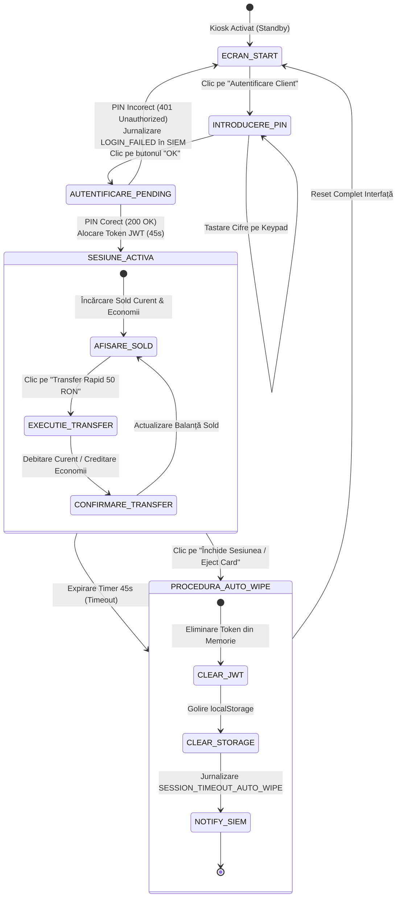
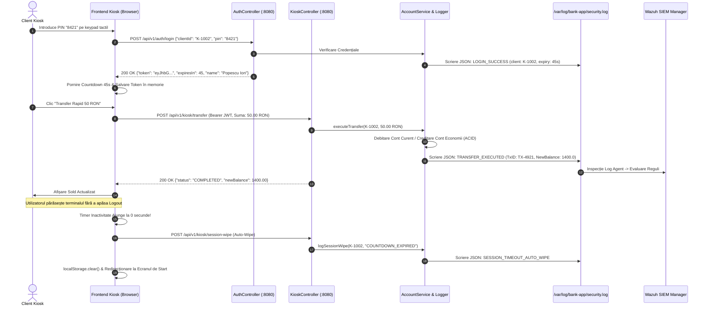
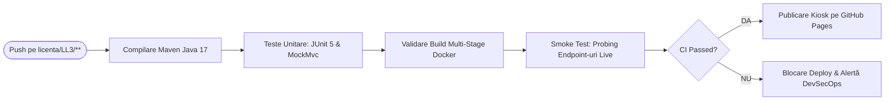

# Nexus Core-Banking Kiosk & Wazuh SIEM Telemetry Engine

<div align="center">

[](https://github.com/stefanutc1/proiecte/actions/workflows/ci.yml)
[-orange?style=flat&logo=openjdk)](backend/pom.xml)
[](backend/pom.xml)
[-blue?style=flat&logo=jsonwebtokens)](backend/src/main/java/ro/ucv/feaa/bank/config/SecurityConfig.java)
[](backend/src/main/java/ro/ucv/feaa/bank/service/StructuredAuditLogger.java)
[](index.html)
[-purple?style=flat&logo=docker)](backend/Dockerfile)
[](../../LICENSE)

</div>

---

## 1. Executive Overview

Acest modul (`licenta/LL3-LucrareLicenta/code/web`) reprezintă subsistemul de interfață utilizator și backend tranzacțional dezvoltat în cadrul lucrării de licență:

> **„Arhitectura și Securitatea Sistemelor Informatice Bancare: Proiectarea, Implementarea și Auditul Rezilienței Cibernetice într-un Mediu Virtualizat”**  
> **Instituție:** Universitatea din Craiova — Facultatea de Economie și Administrarea Afacerilor (FEAA)  
> **Program de Studii:** Informatică Economică (Promoția 2026)  
> **Absolvent:** Moanță Ștefănuț-Cornel

Modulul integrează trei capacități inginerești fundamentale:

1. **Backend Enterprise Java Spring Boot 3.2 (Java 17 LTS):** Implementează securitate stateless prin token-uri JWT semnate criptografic (HMAC-SHA256 / JJWT 0.12), control de acces bazat pe roluri (RBAC), servicii tranzacționale în partidă dublă (*Double-Entry Ledger*) și un subsistem de **jurnalizare structurată JSON** orientat către agentul de securitate **Wazuh HIDS / SIEM**.
2. **Frontend Kiosk Bancar Minimalist (ATM / Self-Service Terminal):** Proiectat conform specificațiilor stricte ale terminalelor ATM securizate:
   * **Zero Navigation Chrome:** Elimină complet barele de navigare exterioare și elementele de context inutile pentru a preveni devierea sesiunii.
   * **Tastatură Numerică pe Ecran (On-Screen Touch Keypad):** Protecție nativă împotriva keylogger-elor hardware sau malware-ului instalat pe sistemul gazdă.
   * **Inactivity Countdown Timer (45s) & Auto-Wipe:** La expirarea timpului de 45 secunde fără activitate, clientul este delogat forțat, token-ul JWT este șters din memorie și din `localStorage`, iar evenimentul este trimis către SIEM.
   * **Consolă SOC Live Retractabilă:** Consolă integrată la baza ecranului pentru vizualizarea în timp real a telemetriei JSON și simularea atacurilor direct în timpul demonstrației de licență.
3. **Arhitectură Hibridă Dual-Mode (Live REST & Zero-Dependency Mock):**
   * **Modul Live (Spring Boot pe Port 8080):** Conectare automată prin `fetch()` asincron la backend-ul Java, persistând evenimentele direct în `/var/log/bank-app/security.log`.
   * **Modul Demo (GitHub Pages):** Atunci când rulează ca pagină web statică, modulul activează automat motorul local `mock-engine.js`, oferind funcționalitate 100% identică în browser fără nicio dependență de infrastructură externă.

---

## 2. Arhitectură și Diagrame de Sistem

### 2.1. Arhitectura Multi-Nivel a Aplicației Kiosk

```mermaid
flowchart TD
    subgraph CLIENT_TIER ["Client / Kiosk Terminal (VM 205 / Browser)"]
        HTML["index.html (ATM Shell)"]
        UI_PAD["Tastatură Numerică On-Screen"]
        TIMER["Timer Inactivitate 45s (Auto-Wipe)"]
        SOC_UI["Consolă Telemetrie SOC Live"]
        API_CLIENT["api.js (Client Hibrid Dual-Mode)"]
        MOCK_ENG["mock-engine.js (Fallback Demo)"]
        
        HTML --> UI_PAD
        HTML --> TIMER
        HTML --> SOC_UI
        UI_PAD --> API_CLIENT
        TIMER --> API_CLIENT
        API_CLIENT -. "Dacă Backend Indisponibil" .-> MOCK_ENG
    end

    subgraph BACKEND_TIER ["Backend Java Spring Boot 3.2 (Port 8080)"]
        direction TB
        SECURITY_FILTER["Spring Security: JwtAuthFilter (Stateless)"]
        
        subgraph CONTROLLERS ["REST Controllers"]
            AUTH_CTRL["AuthController (/api/v1/auth)"]
            KIOSK_CTRL["KioskController (/api/v1/kiosk)"]
            AUDIT_CTRL["AuditController (/api/v1/audit)"]
            PORTAL_CTRL["PortalController (/api/v1/portal)"]
        end
        
        subgraph SERVICES ["Core Business Services"]
            ACC_SRV["AccountService (Partidă Dublă / Balanță)"]
            AUDIT_SRV["StructuredAuditLogger (Formatare JSON Wazuh)"]
        end
        
        SECURITY_FILTER --> AUTH_CTRL
        SECURITY_FILTER --> KIOSK_CTRL
        SECURITY_FILTER --> AUDIT_CTRL
        SECURITY_FILTER --> PORTAL_CTRL
        
        AUTH_CTRL --> ACC_SRV
        KIOSK_CTRL --> ACC_SRV
        ACC_SRV --> AUDIT_SRV
        AUDIT_CTRL --> AUDIT_SRV
    end

    subgraph TELEMETRY_TIER ["Audit & Monitorizare SIEM (VLAN 20 -> CT 106)"]
        LOG_FILE[("/var/log/bank-app/security.log<br/>Jurnal JSON pe linii noi")]
        WAZUH_AGENT["Wazuh Agent HIDS (Inspecție Fisiere Locale)"]
        WAZUH_MGR["Wazuh SIEM Manager (Reguli 100101, 100109)"]
        
        AUDIT_SRV -->|Scriere Imediată (Flush)| LOG_FILE
        LOG_FILE -->|Monitorizare Inotify| WAZUH_AGENT
        WAZUH_AGENT -->|Eveniment Criptat Port 1514| WAZUH_MGR
    end

    API_CLIENT == "REST / JSON (Port 8080)" ==> SECURITY_FILTER
```

### 2.2. Mașina de Stări a Sesiunii Kiosk (Lifecycle & Auto-Wipe)



### 2.3. Diagrama de Secvență: Autentificare, Transfer și Detecție SIEM



---

## 3. Contractul API RESTful (Spring Boot Backend)

Toate endpoint-urile respectă standardele RESTful și returnează răspunsuri în format `application/json`.

### 3.1. Sumarul Endpoint-urilor Expuse

| Metodă HTTP | Endpoint | Securitate / Rol | Request Body | Status Succes | Status Erori | Descriere Operațională |
| :--- | :--- | :--- | :--- | :--- | :--- | :--- |
| `POST` | `/api/v1/auth/login` | Public (PermitAll) | JSON (`LoginRequest`) | `200 OK` | `401 Unauthorized` | Autentificare client prin ID și cod PIN. Emite token JWT cu expirare la 45s. |
| `GET` | `/api/v1/kiosk/balance` | Autentificat (`Bearer JWT`) | N/A | `200 OK` | `401 Unauthorized` | Interogare sold curent și de economii pentru contul titularului autentificat. |
| `POST` | `/api/v1/kiosk/transfer` | Autentificat (`Bearer JWT`) | JSON (`TransferRequest`) | `200 OK` | `400 Bad Request`, `401 Unauthorized` | Executare transfer rapid între conturi proprii în regim de partidă dublă. |
| `POST` | `/api/v1/kiosk/session-wipe` | Public / Autentificat | N/A | `200 OK` | N/A | Curățare forțată a stării sesiunii Kiosk și emitere eveniment audit către SIEM. |
| `POST` | `/api/v1/audit/simulate-anomaly` | Public (Laborator) | JSON (`AnomalyRequest`) | `200 OK` | `500 Internal Error` | Injectare anomalie de securitate (Balance Tampering, SQLi) pentru testare SIEM. |
| `GET` | `/api/v1/audit/recent-logs` | Public (Consolă SOC) | Parametru `limit` (default 20) | `200 OK` | N/A | Returnează ultimele înregistrări din jurnalul local `security.log`. |
| `GET` | `/api/v1/portal/overview` | Autentificat (`Bearer JWT`) | N/A | `200 OK` | `401 Unauthorized` | Profil financiar complet al clientului și istoric al tranzacțiilor recente. |

---

### 3.2. Detalii Tehnice ale Mesajelor REST

#### A. Autentificare Client Kiosk (`POST /api/v1/auth/login`)
* **Request Payload:**
  ```json
  {
    "clientId": "K-1002",
    "pin": "8421"
  }
  ```
* **Response `200 OK`:**
  ```json
  {
    "token": "eyJhbGciOiJIUzI1NiIsInR5cCI6IkpXVCJ9.eyJzdWIiOiJLLTEwMDIiLCJpYXQiOjE3MjY...",
    "expiresIn": 45,
    "clientId": "K-1002",
    "name": "Popescu Ion",
    "iban": "RO99NXCR0001842100000001"
  }
  ```
* **Response `401 Unauthorized` (declanșează alertă de eșec în Wazuh SIEM):**
  ```json
  {
    "error": "Invalid credentials",
    "attemptCount": 3,
    "message": "Cod PIN sau ID client incorect. Eveniment jurnalizat pentru analiza SOC."
  }
  ```

#### B. Interogare Sold (`GET /api/v1/kiosk/balance`)
* **Header Obligatoriu:** `Authorization: Bearer <token_jwt>`
* **Response `200 OK`:**
  ```json
  {
    "iban": "RO99NXCR0001842100000001",
    "balance": 1450.00,
    "currency": "RON",
    "accountType": "CURRENT",
    "savingsBalance": 3200.00,
    "savingsIban": "RO99NXCR0002842100000002"
  }
  ```

#### C. Transfer Rapid Fonduri (`POST /api/v1/kiosk/transfer`)
* **Header Obligatoriu:** `Authorization: Bearer <token_jwt>`
* **Request Payload:**
  ```json
  {
    "targetIban": "RO99NXCR0002842100000002",
    "amount": 50.00
  }
  ```
* **Response `200 OK`:**
  ```json
  {
    "status": "COMPLETED",
    "transactionId": "TX-4921",
    "amount": 50.00,
    "targetIban": "RO99NXCR0002842100000002",
    "newBalance": 1400.00,
    "timestamp": "2026-09-23T00:30:12Z"
  }
  ```

#### D. Simulare Anomalie de Securitate (`POST /api/v1/audit/simulate-anomaly`)
* **Request Payload:**
  ```json
  {
    "anomalyType": "BALANCE_TAMPERING_INJECTION",
    "details": "Discrepanță forțată în baza de date pentru testare Wazuh Rule 100109",
    "triggerHttp500": false
  }
  ```
* **Response `200 OK`:**
  ```json
  {
    "status": "ANOMALY_LOGGED",
    "anomalyType": "BALANCE_TAMPERING_INJECTION",
    "wazuhTargetFile": "/var/log/bank-app/security.log",
    "wazuhRuleId": 100109,
    "message": "Evenimentul suspect a fost scris cu succes in logul auditat de agentul Wazuh."
  }
  ```

---

## 4. Integrarea cu Wazuh SIEM („Secret Sauce”)

Backend-ul Java Spring Boot scrie automat fiecare eveniment de securitate în format **JSON delimitat pe linii noi** (NDJSON) în calea `/var/log/bank-app/security.log` (cu mecanism de fallback local în `./logs/security.log` dacă permisiunile de root lipsesc pe mașina locală).

### 4.1. Structura Înregistrărilor JSON de Audit

```json
{"timestamp":"2026-09-23T00:20:15Z","event":"LOGIN_FAILED","client":"K-1002","sourceIp":"192.168.30.50","reason":"BAD_PIN","attemptCount":3}
{"timestamp":"2026-09-23T00:21:00Z","event":"LOGIN_SUCCESS","client":"K-1002","sourceIp":"192.168.20.100","sessionExpiresIn":45,"iban":"RO99NXCR0001842100000001"}
{"timestamp":"2026-09-23T00:21:12Z","event":"TRANSFER_EXECUTED","client":"K-1002","sourceIp":"192.168.20.100","amount":50.0,"sourceIban":"RO99NXCR0001842100000001","targetIban":"RO99NXCR0002842100000002","txId":"TX-7812","newBalance":1400.0}
{"timestamp":"2026-09-23T00:21:45Z","event":"SESSION_TIMEOUT_AUTO_WIPE","client":"K-1002","sourceIp":"192.168.20.100","reason":"COUNTDOWN_EXPIRED","action":"AUTO_WIPE_CREDENTIALS"}
{"timestamp":"2026-09-23T00:22:10Z","event":"SIMULATED_ANOMALY_TRIGGERED","client":"ADMIN_CONSOLE","sourceIp":"192.168.20.100","anomalyType":"BALANCE_TAMPERING_INJECTION","severity":"CRITICAL","details":"Discrepanță simulată în ledger","wazuhRuleId":100109,"mitreTechnique":"T1565.001"}
```

### 4.2. Configurare în Agentul Wazuh (`/var/ossec/etc/ossec.conf`)

Pentru ca agentul Wazuh instalat pe mașina virtuală a aplicației (VM 310 / VM 205) să colecteze automat telemetria Kiosk-ului:

```xml
<ossec_config>
  <localfile>
    <log_format>json</log_format>
    <location>/var/log/bank-app/security.log</location>
  </localfile>
</ossec_config>
```

### 4.3. Reguli Wazuh Personalizate (`/var/ossec/etc/rules/local_rules.xml`)

Definiția regulilor SIEM pentru corelarea anomaliilor financiare:

```xml
<group name="banking,security_app,">
  <!-- Regula 100101: Tentative de SQL Injection sau Eșec Autentificare Repetat -->
  <rule id="100101" level="10">
    <decoded_as>json</decoded_as>
    <field name="event">LOGIN_FAILED</field>
    <description>Banking App: Tentativă de autentificare eșuată la terminalul Kiosk</description>
    <mitre>
      <id>T1110</id>
    </mitre>
  </rule>

  <!-- Regula 100109: Balance Tampering & Modificare Neautorizată de Ledger -->
  <rule id="100109" level="14">
    <decoded_as>json</decoded_as>
    <field name="anomalyType">BALANCE_TAMPERING_INJECTION</field>
    <description>ALERTA CRITICA: Discrepanță detectată între balanța contului și registrul tranzacțional</description>
    <mitre>
      <id>T1565.001</id>
    </mitre>
  </rule>
</group>
```

---

## 5. Ghid Operațional: Rulare, Testare și Containerizare

### 5.1. Cerințe Preliminare

* **Java Development Kit (JDK):** Versiunea 17 sau mai nouă (Eclipse Temurin / OpenJDK).
* **Apache Maven:** Versiunea 3.8+ (sau folosirea wrapper-ului).
* **Motor Containerizare (Opțional):** Docker 24+ / Podman 4+.

---

### 5.2. Opțiunea A: Rulare Locală prin Maven

```bash
# 1. Navigare în directorul backend-ului
cd licenta/LL3-LucrareLicenta/code/web/backend

# 2. Compilare și împachetare JAR (fără rulare teste)
mvn clean package -DskipTests

# 3. Pornire aplicație Spring Boot
mvn spring-boot:run
```

Aplicația pornește pe portul `8080`, iar interfața web completă este accesibilă la adresa:  
👉 `http://localhost:8080/`

---

### 5.3. Opțiunea B: Rulare Executabil Standalone JAR

```bash
cd licenta/LL3-LucrareLicenta/code/web/backend
java -jar target/bank-kiosk-backend-1.0.0.jar
```

---

### 5.4. Opțiunea C: Containerizare Docker Multi-Stage

Proiectul conține un fișier [`Dockerfile`](backend/Dockerfile) optimizat în două etape (Builder cu Maven + Runtime minimalist Eclipse Temurin JRE):

```bash
cd licenta/LL3-LucrareLicenta/code/web/backend

# 1. Construire imagine container
docker build -t bank-kiosk-app:latest .

# 2. Rulare container cu montare volum pentru log-urile Wazuh
docker run -d \
  --name bank-kiosk-instance \
  -p 8080:8080 \
  -v /var/log/bank-app:/var/log/bank-app \
  bank-kiosk-app:latest
```

Verificare container activ:
```bash
docker ps -f name=bank-kiosk-instance
docker logs -f bank-kiosk-instance
```

Oprire și eliminare container:
```bash
docker stop bank-kiosk-instance
docker rm bank-kiosk-instance
```

---

### 5.5. Execuția Testelor Unitare și de Integrare

Suita de teste este scrisă cu **JUnit 5** și **Spring Boot Test**:

```bash
cd licenta/LL3-LucrareLicenta/code/web/backend
mvn test
```

Execuția testului integrat de smoke test (probare HTTP live a tuturor rutelor):

```bash
cd licenta/LL3-LucrareLicenta/code
python3 smoke_test_backend.py
```

---

### 5.6. Ghid de Diagnosticare și Remediere (Troubleshooting)

| Simptom / Mesaj de Eroare | Cauză Rădăcină | Verificare Diagnostic | Măsură de Remediere |
| :--- | :--- | :--- | :--- |
| `Port 8080 was already in use.` | Un alt proces (FastAPI, alt Tomcat sau proces Java zombie) ocupă portul `8080`. | `lsof -i :8080` | Închideți procesul concurent cu `kill -9 <PID>` sau ajustați `server.port` în `application.yml`. |
| `FileNotFoundException: /var/log/bank-app/security.log` | Lipsă permisiuni de scriere în `/var/log` pentru utilizatorul non-root. | Verificați `ls -ld /var/log/bank-app` | Creați directorul cu permisiuni adecvate: `sudo mkdir -p /var/log/bank-app && sudo chmod 777 /var/log/bank-app`. Aplicația utilizează automat fallback-ul `./logs/security.log`. |
| Badge-ul din Kiosk indică `DEMO (Mock Engine)` în loc de `LIVE`. | Backend-ul Spring Boot nu este pornit sau există un blocaj CORS. | Deschideți Developer Tools (F12) -> Console. | Asigurați-vă că backend-ul rulează pe `http://localhost:8080` și răspunde pe `/api/v1/audit/recent-logs`. |
| `401 Unauthorized` la interogarea `/api/v1/kiosk/balance`. | Token-ul JWT a expirat (durata maximă de viață este de 45 secunde) sau lipsește din header. | Verificați valabilitatea câmpului `exp` din payload-ul JWT. | Reautentificați-vă prin introducerea din nou a codului PIN pe tastatura Kiosk-ului. |

---

## 6. Integrare în Pipeline-ul CI/CD

Modulul web este integrat în workflow-ul GitHub Actions [`.github/workflows/ci.yml`](../../../../.github/workflows/ci.yml) și [`.github/workflows/deploy-gh-pages.yml`](../../../../.github/workflows/deploy-gh-pages.yml):



---

## 7. Structura Fișierelor Modulului `code/web`

```text
licenta/LL3-LucrareLicenta/code/web/
├── README.md                             # Această documentație tehnică standardizată
├── index.html                            # Interfața web securizată a terminalului ATM Kiosk
├── css/
│   └── kiosk.css                         # Stiluri ATM, interfață tactilă, consolă SOC și temă întunecată
├── js/
│   ├── api.js                            # Client API hibrid (conectare automată Spring Boot / Fallback Demo)
│   ├── app.js                            # Controller principal UI, mașină de stări Kiosk, timer 45s, Auto-Wipe
│   └── mock-engine.js                    # Simulator in-browser autonom pentru găzduire statică pe GitHub Pages
└── backend/                              # Aplicație Java 17 Spring Boot 3.2
    ├── pom.xml                           # Configurație Maven (Spring Security, JJWT, Actuator, JUnit 5)
    ├── Dockerfile                        # Script de construire container Docker multi-stage
    └── src/
        ├── main/
        │   ├── java/ro/ucv/feaa/bank/
        │   │   ├── BankApplication.java  # Punctul de intrare Spring Boot
        │   │   ├── config/               # JwtAuthFilter, JwtUtil, SecurityConfig, WebCorsConfig
        │   │   ├── controller/           # AuthController, KioskController, AuditController, PortalController
        │   │   ├── dto/                  # AnomalyRequest, BalanceResponse, LoginRequest, TransferResponse
        │   │   ├── model/                # Entități BankAccount și BankTransaction
        │   │   └── service/              # AccountService (partidă dublă) și StructuredAuditLogger (Wazuh JSON)
        │   └── resources/
        │       ├── application.yml       # Setări port 8080, cheie JWT, căi fișiere log
        │       └── static/               # Copie frontend inclusă direct în pachetul JAR
        └── test/
            └── java/ro/ucv/feaa/bank/    # Suită de teste automate JUnit 5 (BankApplicationTests, AccountServiceTest)
```

---

## 8. Documente Conexe și Navigare

* [Python Core Banking & Attack Simulation Documentation](../README.md) — Documentația tehnică a motoarelor de simulare Python, a bazei de date și a suitei MITRE ATT&CK.
* [Master README Lucrare de Licență](../../README.md) — Documentul principal de referință arhitecturală și academică.
* [CI Workflow Definiție](../../../../.github/workflows/ci.yml) — Pipeline-ul complet de verificare și testare automată.
* [Docker Container Manifest](backend/Dockerfile) — Specificația imaginii de containerizare multi-stage.
